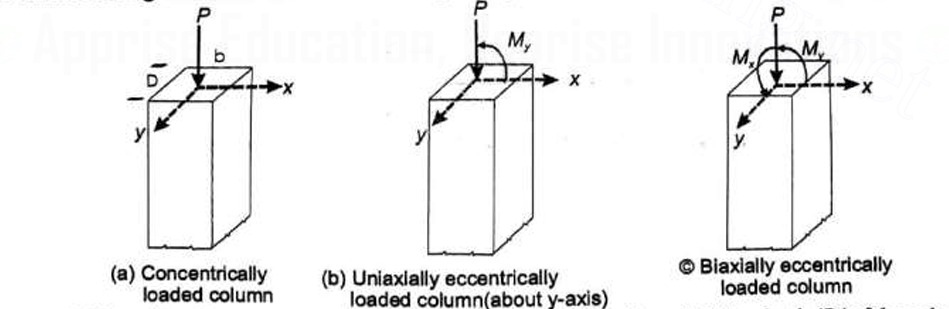
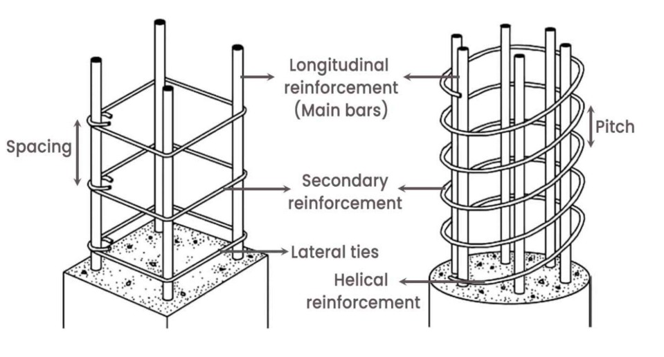

## Design a reinforced concrete (RC) short column subjected to an axial load
### Theory : 

Column or strut is a compression member, the effective length of which exceeds three times the least lateral dimension. 
A compression member may be considered as short when both the slender ratios lex/D and ley/b than less than 12.  
Where, lex = effective length in respect of the major axis, 
       D = depth in respect of the major axis, 
       ley = effective length in respect of the minor axis, and 
       b = width of the member 
It shall otherwise be considered as a slender compression member. 
Short columns fail due to compressive crushing and are governed by material strength. 
Long columns fail due to buckling instability, which depends on slenderness ratio and end conditions. 
The column is provided with longitudinal and transverse reinforcement. The transverse steel is in the form of ties or closely spaced spirals.  Longitudinal reinforcement consists of main bars tied with transverse links or helical reinforcement. Tied and spiral columns are normally used in reinforced concrete construction out of which tied columns are very common. 

##### Classification of column:  
* Classification of column based on loading:  

The column is subjected to axial load uniaxial bending and biaxial bending as shown in the Fig 1. The column shown in Fig.1.(a) carries the load along its centroidal axis is termed as axially loaded column. Such ideal column rarely occurs in practice. The columns in buildings are normally subjected to axial compression and bending. If a column carries axial compression and bending moment about either x-axis or y-axis it is termed as column subjected to axial load and uniaxial bending as shown in Fig.1(b). The end columns in a buildings are normally subjected to bending about either x or y-axes. While if it is subjected to moment about both the axes in addition to axial load it is termed as column subjected to biaxial bending. The corner columns in a building are subjected to axial load and biaxial bending (Fig.1.(c)).

 

Mx is cosidered as moment acting about major 'x' axis of bending, dividing depth 'D' of the column while, My, is cosidered as moment acting about minor 'y' axis of bending, dividing width 'b' of the column.  

##### Classification of Column Based on Reinforcement:  
##### Concrete columns are mainly classified into the following two types:  

(a) Column with Lateral ties: In this case the main reinforcing longitudinal bars are enclosed within closely spaced lateral ties (Fig.2 (a)) 

(b) Column with Spirals: In this case the main reinforcing longitudinal bars are enclosed within closely spaced and continuously wound spiral reinforcement (Fig.2 (b)) 

 
##### Design Steps :
1.  Define Design Parameters:
Specify the applied axial load (Pu) on the column.
Choose design values for concrete strength (fck) and steel yield strength (fy) based on material specifications and code requirements.
Select a desired concrete cover thickness for durability (refer to building codes).
2.	Determine Column Dimensions:
Considering architectural constraints and spacing requirements, choose a preliminary rectangular or square cross-section for the column (b x h).
Check code provisions for minimum column dimensions.
3.	Effective Length Calculation:
Based on the end support conditions (fixed, hinged, etc.), calculate the effective length (Le) of the column using code formulas.
4.	Slenderness Ratio Check:
Calculate the slenderness ratio (Le/b) for the chosen dimensions.
Verify the slenderness ratio is less than the code limit for short column design.
5.	Minimum Reinforcement Ratio:
Determine the minimum required area of steel reinforcement (Asc,min) based on code provisions and concrete strength.
6.	Strength Design:
Assume a trial reinforcement ratio within the allowed limits (typically 0.01 to 0.08).
Use code equations to calculate the resisting capacity of the reinforced concrete section (Pu, capacity).
If Pu, capacity is less than the applied load (Pu), adjust the reinforcement ratio and repeat the calculation until a safe design is achieved (Pu, capacity >= Pu).
7.	Serviceability Check:
Depending on the code and project requirements, perform calculations to ensure the column deflection under service loads (including dead load) is within acceptable limits.
8.	Reinforcement Details:
Determine the number and diameter of longitudinal steel bars required to achieve the calculated area of reinforcement (Asc).
Design and specify the spacing, diameter, and minimum requirements for lateral ties to ensure confinement of concrete and prevent buckling of steel bars.
9.	Code Compliance Check:
Verify the final design meets all relevant code requirements for concrete cover, minimum bar spacing, fire resistance, etc.